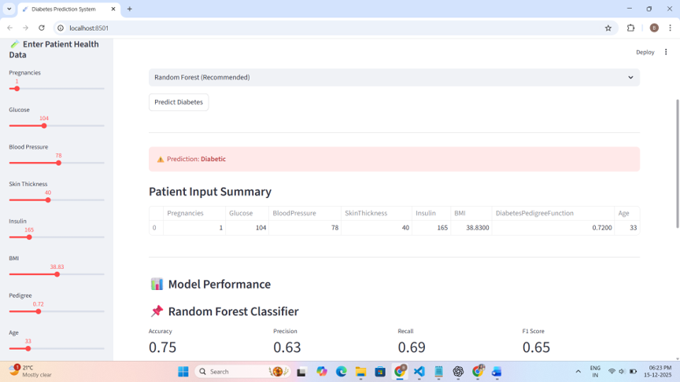

# 🩺 Machine Learning-Based Diagnosis of Diabetes

A **Machine Learning-based Diabetes Diagnosis System** developed using Python and supervised learning techniques. The project analyzes medical parameters and predicts whether a patient is likely to have diabetes.

The project demonstrates how machine learning can be applied to healthcare data to support **early diabetes risk assessment**.

## 📌 Project Overview

Diabetes is a common chronic disease that requires early detection and proper management. Manual analysis of multiple medical parameters can be time-consuming.

This project uses a machine learning approach to analyze patient health information and generate a diabetes prediction.

The system takes relevant medical parameters as input and provides a predicted result through a simple application interface.

## 🎯 Objectives

* Develop a machine learning model for diabetes prediction
* Analyze important medical attributes associated with diabetes
* Perform data preprocessing and model training
* Evaluate the predictive performance of the model
* Build a simple user interface for obtaining predictions
* Demonstrate the practical application of machine learning in healthcare

## ✨ Key Features

* 🩺 Diabetes prediction using machine learning
* 📊 Medical dataset analysis
* 🧹 Data preprocessing
* 🤖 Supervised machine learning classification
* 📈 Model evaluation
* 🖥️ Simple prediction interface
* 📋 Prediction result display

## 🛠️ Technology Stack

| Technology   | Purpose                                    |
| ------------ | ------------------------------------------ |
| Python       | Machine Learning & application development |
| Pandas       | Data loading and preprocessing             |
| NumPy        | Numerical operations                       |
| Scikit-learn | Machine learning algorithms and evaluation |
| Matplotlib   | Data visualization                         |
| Streamlit    | Interactive web application                |

## 📊 Dataset

The project uses a diabetes dataset containing medical attributes used to determine whether a person is likely to have diabetes.

The dataset includes parameters such as:

* Pregnancies
* Glucose
* Blood Pressure
* Skin Thickness
* Insulin
* BMI
* Diabetes Pedigree Function
* Age
* Outcome

The `Outcome` variable represents the prediction target:

```text
0 → Non-Diabetic
1 → Diabetic
```

## 🔄 Machine Learning Workflow

```text
                 ┌──────────────────┐
                 │  Diabetes Dataset│
                 └────────┬─────────┘
                          ↓
                 ┌──────────────────┐
                 │ Data Preprocessing│
                 └────────┬─────────┘
                          ↓
                 ┌──────────────────┐
                 │ Feature Selection│
                 └────────┬─────────┘
                          ↓
                 ┌──────────────────┐
                 │ Train ML Model   │
                 └────────┬─────────┘
                          ↓
                 ┌──────────────────┐
                 │ Model Evaluation │
                 └────────┬─────────┘
                          ↓
                 ┌──────────────────┐
                 │ User Input       │
                 └────────┬─────────┘
                          ↓
                 ┌──────────────────┐
                 │ Diabetes Prediction│
                 └──────────────────┘
```

## 🧠 Machine Learning Approach

The project follows a standard supervised machine learning pipeline.

### 1. Data Loading

The diabetes dataset is loaded using Python data-processing libraries.

### 2. Data Preprocessing

The dataset is inspected and prepared for machine learning by handling the input features and target variable.

### 3. Feature and Target Separation

The medical attributes are used as input features, while `Outcome` is used as the target variable.

```python
X = data.drop("Outcome", axis=1)
y = data["Outcome"]
```

### 4. Model Training

The processed dataset is divided into training and testing data and used to train a classification model.

### 5. Prediction

After training, the model receives patient parameters and predicts whether the input is classified as diabetic or non-diabetic.

## 📁 Project Structure

```text
Machine-Learning-Based-Diagnosis-of-Diabetes/
│
├── new.py
├── diabetes_800.csv
├── requirement
├── result.png
├── Presentation_Diabetes.pdf
└── README.md
```

### File Description

**`new.py`**
Main Python application containing the machine learning and prediction implementation.

**`diabetes_800.csv`**
Dataset used for training/testing the diabetes prediction model.

**`requirement`**
Contains the required Python packages for running the project.

**`result.png`**
Screenshot of the prediction/application output.

**`Presentation_Diabetes.pdf`**
Project presentation containing details about the system.

## ⚙️ Installation

### 1. Clone the Repository

```bash
git clone https://github.com/bhawna31/Machine-Learning-Based-Diagnosis-of-Diabetes.git
```

### 2. Navigate to the Project

```bash
cd Machine-Learning-Based-Diagnosis-of-Diabetes
```

### 3. Create a Virtual Environment

```bash
python -m venv venv
```

Activate it on Windows:

```bash
venv\Scripts\activate
```

### 4. Install Dependencies

```bash
pip install -r requirement
```

If the project is configured to use Streamlit, install it with:

```bash
pip install streamlit
```

## ▶️ Run the Application

Run the Python application according to the implementation in `new.py`.

For a Streamlit-based interface:

```bash
streamlit run new.py
```

The application will open in your browser.

## 🖥️ Application Result

The project includes an example output screenshot:



The application accepts patient-related medical parameters and displays the corresponding prediction result.

## 📈 Model Evaluation

The model is evaluated using standard classification metrics such as:

* Accuracy
* Precision
* Recall
* F1-score
* Confusion Matrix

These metrics help assess how effectively the model distinguishes between diabetic and non-diabetic cases.

## 🔮 Future Enhancements

The project can be further improved by adding:

* [ ] Comparison of multiple machine learning algorithms
* [ ] Hyperparameter tuning
* [ ] Cross-validation
* [ ] Feature importance visualization
* [ ] Interactive data visualization
* [ ] Model explainability using SHAP
* [ ] Improved UI/UX
* [ ] Cloud deployment
* [ ] REST API for prediction
* [ ] Patient history and prediction tracking

## ⚠️ Disclaimer

This project is developed for **educational and research purposes**. The predictions generated by the system should **not be considered a medical diagnosis** or a substitute for professional medical advice.

Users should consult a qualified healthcare professional for actual diagnosis and treatment decisions.

## 👩‍💻 Author

**Bhawna Jha**

MCA | Python | Machine Learning | Data Science | SQL

## 🔗 Repository

[Machine Learning-Based Diagnosis of Diabetes](https://github.com/bhawna31/Machine-Learning-Based-Diagnosis-of-Diabetes)

---

⭐ If you find this project useful, consider giving the repository a star.
